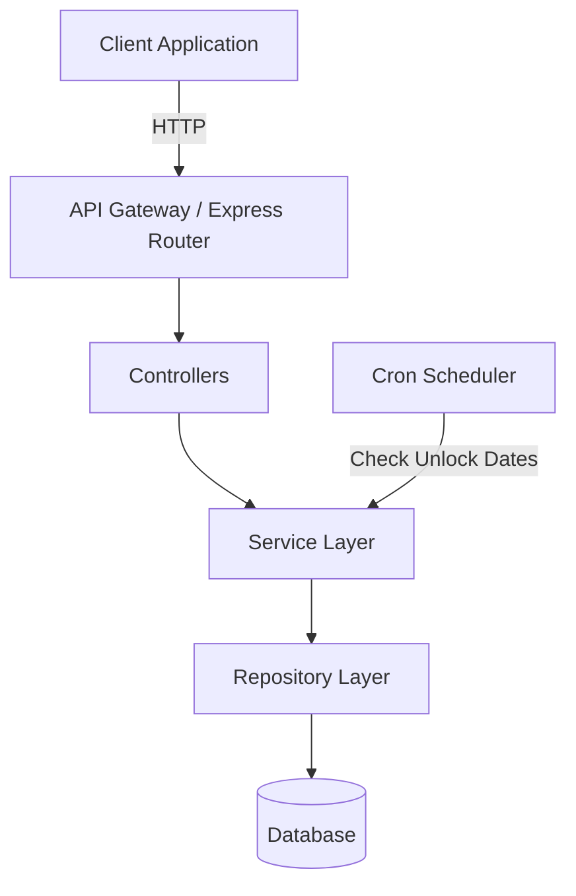

# Design Document

## Overview

TimeGrave API는 RESTful 아키텍처를 기반으로 한 백엔드 서비스로, 타임캡슐(Tombstone) 관리 기능을 제공합니다. 이 시스템은 Python FastAPI 프레임워크를 사용하여 구현되며, SQLite 데이터베이스를 사용하여 데이터를 영구 저장합니다. Docker를 통해 컨테이너화되어 배포됩니다. MVP 버전에서는 단일 사용자(userId=1)만 지원하며, 인증 기능은 포함하지 않습니다.

## Architecture

### System Architecture



### Layer Responsibilities

1. **API Router (FastAPI Router)**
   - HTTP 요청 라우팅
   - 자동 요청/응답 검증 (Pydantic)
   - CORS 관리
   - OpenAPI 문서 자동 생성

2. **Route Handlers**
   - HTTP 요청 처리
   - Pydantic 모델을 통한 입력 검증
   - 응답 형식 변환

3. **Service Layer**
   - 비즈니스 로직 구현
   - 날짜 계산 및 상태 관리
   - 트랜잭션 관리

4. **Repository Layer**
   - 데이터베이스 쿼리 실행
   - SQLAlchemy ORM 매핑
   - 데이터 접근 추상화

5. **Background Scheduler (APScheduler)**
   - 주기적인 Tombstone 상태 확인
   - 자동 잠금 해제 처리

## Components and Interfaces

### API Endpoints

```typescript
GET /api/graveyard
POST /api/tombstones
GET /api/tombstones/:id
```

### Core Models (Pydantic)

#### Tombstone Model

```python
from pydantic import BaseModel
from datetime import datetime
from typing import Optional

class Tombstone(BaseModel):
    id: int
    user_id: int
    title: str
    content: str
    unlock_date: datetime
    is_unlocked: bool
    created_at: datetime
    updated_at: datetime
    
    class Config:
        from_attributes = True
```

#### API Response Models

```python
from typing import Generic, TypeVar, Optional
from pydantic import BaseModel

T = TypeVar('T')

class ApiSuccessResponse(BaseModel, Generic[T]):
    status: int
    data: dict  # Contains 'result' and optional 'response'

class ApiErrorResponse(BaseModel):
    status: int
    error: dict  # Contains 'message'
```

### Service Interface

#### TombstoneService

```python
from typing import List, Optional

class TombstoneService:
    def create_tombstone(self, data: CreateTombstoneDto) -> Tombstone:
        pass
    
    def get_tombstone(self, tombstone_id: int) -> Optional[Tombstone]:
        pass
    
    def list_tombstones(self) -> List[Tombstone]:
        pass
    
    def check_and_unlock_tombstones(self) -> None:
        pass
```

## Data Models

### Database Schema

#### Tombstones Table

```sql
CREATE TABLE tombstones (
  id INTEGER PRIMARY KEY AUTOINCREMENT,
  user_id INTEGER NOT NULL DEFAULT 1,
  title VARCHAR(255) NOT NULL,
  content TEXT NOT NULL,
  unlock_date DATE NOT NULL,
  is_unlocked BOOLEAN DEFAULT FALSE,
  created_at TIMESTAMP DEFAULT CURRENT_TIMESTAMP,
  updated_at TIMESTAMP DEFAULT CURRENT_TIMESTAMP
);

CREATE INDEX idx_tombstones_user_id ON tombstones(user_id);
CREATE INDEX idx_tombstones_unlock_date ON tombstones(unlock_date);
CREATE INDEX idx_tombstones_is_unlocked ON tombstones(is_unlocked);
```

### Data Transfer Objects (Pydantic Schemas)

#### CreateTombstoneDto

```python
from pydantic import BaseModel, Field
from datetime import date

class CreateTombstoneDto(BaseModel):
    user_id: int = Field(default=1, description="Always 1 in MVP")
    title: str = Field(..., min_length=1, max_length=255)
    content: str = Field(..., min_length=1)
    unlock_date: date = Field(..., description="Date when tombstone unlocks")
```

#### TombstoneResponseDto

```python
from pydantic import BaseModel
from datetime import datetime
from typing import Optional

class TombstoneResponseDto(BaseModel):
    id: int
    user_id: int
    title: str
    content: Optional[str] = None  # Only included if unlocked
    unlock_date: str
    is_unlocked: bool
    days_remaining: Optional[int] = None  # Only included if locked
    created_at: str
    updated_at: str
```

### API Request/Response Examples

#### GET /api/graveyard

**Request:**
```
GET /api/graveyard
```

**Response (200 OK):**
```json
{
  "status": 200,
  "data": {
    "result": [
      {
        "id": 1,
        "userId": 1,
        "title": "첫 번째 기억",
        "unlockDate": "2025-12-31",
        "isUnlocked": false,
        "daysRemaining": 365,
        "createdAt": "2025-01-01T00:00:00Z",
        "updatedAt": "2025-01-01T00:00:00Z"
      },
      {
        "id": 2,
        "userId": 1,
        "title": "두 번째 기억",
        "unlockDate": "2024-01-01",
        "isUnlocked": true,
        "content": "이미 열린 기억의 내용",
        "createdAt": "2024-01-01T00:00:00Z",
        "updatedAt": "2024-01-01T00:00:00Z"
      }
    ]
  }
}
```

#### POST /api/tombstones

**Request:**
```json
{
  "userId": 1,
  "title": "모나리자",
  "content": "루브르 박물관에서 본 모나리자의 미소",
  "unlockDate": "2026-11-08"
}
```

**Response (201 Created):**
```json
{
  "status": 201,
  "data": {
    "result": {
      "id": 1,
      "userId": 1,
      "title": "모나리자",
      "unlockDate": "2026-11-08",
      "isUnlocked": false,
      "createdAt": "2025-11-08T11:17:06Z",
      "updatedAt": "2025-11-08T11:17:06Z"
    },
    "response": "모나리자(와)과의 즐거운 대화를 나눠보세요!"
  }
}
```

**Error Response (400 Bad Request):**
```json
{
  "status": 400,
  "error": {
    "message": "Unlock date must be in the future"
  }
}
```

#### GET /api/tombstones/:id

**Request:**
```
GET /api/tombstones/1
```

**Response (200 OK - Locked):**
```json
{
  "status": 200,
  "data": {
    "result": {
      "id": 1,
      "userId": 1,
      "title": "모나리자",
      "unlockDate": "2026-11-08",
      "isUnlocked": false,
      "daysRemaining": 365,
      "createdAt": "2025-11-08T11:17:06Z",
      "updatedAt": "2025-11-08T11:17:06Z"
    }
  }
}
```

**Response (200 OK - Unlocked):**
```json
{
  "status": 200,
  "data": {
    "result": {
      "id": 1,
      "userId": 1,
      "title": "모나리자",
      "content": "루브르 박물관에서 본 모나리자의 미소",
      "unlockDate": "2025-11-08",
      "isUnlocked": true,
      "createdAt": "2025-11-08T11:17:06Z",
      "updatedAt": "2025-11-08T11:17:06Z"
    }
  }
}
```

**Error Response (404 Not Found):**
```json
{
  "status": 404,
  "error": {
    "message": "Tombstone not found"
  }
}
```


## Correctness Properties

*A property is a characteristic or behavior that should hold true across all valid executions of a system-essentially, a formal statement about what the system should do. Properties serve as the bridge between human-readable specifications and machine-verifiable correctness guarantees.*

### Graveyard Dashboard Properties

Property 1: Graveyard completeness
*For any* database state, querying the graveyard should return all tombstones with userId=1
**Validates: Requirements 1.1**

Property 2: Locked tombstone days remaining
*For any* locked tombstone, the response should include a daysRemaining field with the correct number of days between current date and unlock date
**Validates: Requirements 1.2**

Property 3: Unlocked tombstone indication
*For any* unlocked tombstone in the graveyard list, the isUnlocked field should be true
**Validates: Requirements 1.3**

### Tombstone Creation Properties

Property 4: Valid tombstone creation
*For any* valid title, content, and future unlock date, creating a tombstone should result in a new tombstone with isUnlocked=false
**Validates: Requirements 2.1**

Property 5: Past date rejection
*For any* unlock date in the past, tombstone creation should be rejected with status 400
**Validates: Requirements 2.2**

Property 6: Tombstone userId assignment
*For any* created tombstone, the userId field should equal 1
**Validates: Requirements 2.3**

Property 7: Creation response format
*For any* successful tombstone creation, the response should have status 201 and include the created tombstone data
**Validates: Requirements 2.4**

Property 8: Required fields validation
*For any* tombstone creation request missing title, content, or unlockDate, the request should be rejected with status 400
**Validates: Requirements 2.5**

### Tombstone Retrieval Properties

Property 9: Unlocked content accessibility
*For any* unlocked tombstone, requesting that tombstone should return the content field in the response
**Validates: Requirements 3.1**

Property 10: Locked content filtering
*For any* locked tombstone, requesting that tombstone should not include the content field in the response
**Validates: Requirements 3.2**

Property 11: Non-existent tombstone error
*For any* non-existent tombstone ID, requesting that tombstone should return status 404
**Validates: Requirements 3.3**

Property 12: Automatic unlock on date
*For any* tombstone with unlock date <= current date, the tombstone should have isUnlocked=true
**Validates: Requirements 3.4, 4.1**

Property 13: Content accessible after unlock
*For any* tombstone that transitions to unlocked state, subsequent requests should include the content field
**Validates: Requirements 4.2**

Property 14: Batch unlock
*For any* set of tombstones with the same unlock date, when that date arrives, all tombstones should have isUnlocked=true
**Validates: Requirements 4.3**

### API Response Format Properties

Property 15: Success response format
*For any* successful API request, the response should include a status field and a data.result field
**Validates: Requirements 5.1**

Property 16: Error response format
*For any* failed API request, the response should include a status field and an error.message field
**Validates: Requirements 5.2**

Property 17: JSON response format
*For any* API response, the content should be valid JSON
**Validates: Requirements 5.3**

Property 18: Creation response message
*For any* successful tombstone creation, the response should include a data.response field with a user-friendly message
**Validates: Requirements 5.4**

## Error Handling

### Error Categories

1. **Validation Errors (400 Bad Request)**
   - Missing required fields (title, content, unlockDate)
   - Invalid date format
   - Past unlock date
   - Invalid data types

2. **Not Found Errors (404 Not Found)**
   - Non-existent tombstone ID

3. **Server Errors (500 Internal Server Error)**
   - Database connection failure
   - Unexpected system errors

### Error Response Format

All error responses follow this structure:

```json
{
  "status": 400,
  "error": {
    "message": "Human-readable error message"
  }
}
```

### Error Handling Strategy

1. **Input Validation**: Validate all inputs at the controller layer before passing to services
2. **Try-Catch Blocks**: Wrap all async operations in try-catch blocks
3. **Logging**: Log all errors with appropriate severity levels
4. **User-Friendly Messages**: Return clear, actionable error messages to clients

## Testing Strategy

### Unit Testing

Unit tests will verify specific functionality of individual components:

- **Service Layer Tests**: Test business logic in isolation using mocked repositories
- **Repository Layer Tests**: Test database queries using a test database
- **Utility Function Tests**: Test date calculation functions

Example unit test cases:
- Test date calculation for days remaining
- Test unlock date validation (past vs future)
- Test tombstone state transitions

### Property-Based Testing

Property-based tests will verify universal properties across many randomly generated inputs using **fast-check** library for Node.js/TypeScript.

Each property-based test will:
- Run a minimum of 100 iterations with randomly generated data
- Be tagged with a comment explicitly referencing the correctness property in the design document
- Use the format: `**Feature: timegrave-api, Property {number}: {property_text}**`

Property test generators will:
- Generate valid and invalid dates (past, present, future)
- Generate various string lengths for title and content
- Generate valid and invalid tombstone IDs
- Generate edge cases (empty strings, very long strings, special characters)

Example property test structure:

```typescript
// **Feature: timegrave-api, Property 4: Valid tombstone creation**
test('Property 4: Valid tombstone creation', async () => {
  await fc.assert(
    fc.asyncProperty(
      fc.string({ minLength: 1, maxLength: 255 }),
      fc.string({ minLength: 1, maxLength: 10000 }),
      fc.date({ min: new Date() }),
      async (title, content, unlockDate) => {
        const result = await tombstoneService.createTombstone({
          userId: 1,
          title,
          content,
          unlockDate: unlockDate.toISOString()
        });
        expect(result.isUnlocked).toBe(false);
        expect(result.userId).toBe(1);
      }
    ),
    { numRuns: 100 }
  );
});
```

### Integration Testing

Integration tests will verify the interaction between multiple components:

- API endpoint tests using supertest
- Database integration tests
- Tombstone lifecycle tests (create → lock → unlock → access)
- Scheduler tests for automatic unlocking

### Test Coverage Goals

- Unit test coverage: 80% minimum
- Property-based tests: One test per correctness property
- Integration tests: Cover all API endpoints

### Testing Tools

- **Test Framework**: pytest
- **Property-Based Testing**: Hypothesis
- **API Testing**: httpx (FastAPI TestClient)
- **Test Database**: SQLite (in-memory for tests)
- **Mocking**: unittest.mock
